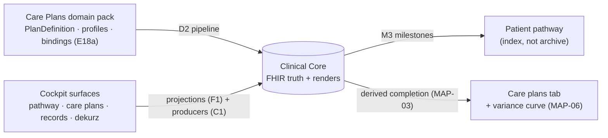

# Care Plans × Patient Pathway × Clinical Core — Binding Map v0.1

> **Authority: NORMATIVE for the bindings** listed here (MAP-* rules and the tables).
> Everything else is informative glue. Sources of truth remain: CORE-TECH-CLINICAL-CORE
> v0.10 (the Core), CP-TECH-STANDARD (the Care Plans domain), cp-15 (SOAP/CASE/ENC/BILL —
> the cockpit record model). On conflict: Core > CP standard > this map (fix the map).
> **Purpose:** this is the join. One part of care-plan logic (the dekurz/render engine) was
> generalized into the Core; the patient pathway is born in the cockpit. Both are now
> **consumers of the same Core** — connecting them is mapping, not new architecture.

---

## M1. The three layers and who owns what

| Layer | Owns | Does NOT own |
|---|---|---|
| **Clinical Core** (core-01) | FHIR truth (B2), renders (D), timeline projection (F1), producers (C) | domain logic, UI |
| **Care Plans domain** (CP standard, SM+ first) | protocol logic (PlanDefinition/CarePlan), phases/steps, gating, patient surface cards | any clinical store (E1), rendering engine |
| **Cockpit** (prototype → product) | surfaces: pathway, care-plans tab, records, communication, notes, consilium, dekurz modal, PHR panel, IQ widget | any clinical truth — every surface is a projection or producer |

## M2. Cockpit surface → Core binding (normative)

| Cockpit surface | Core binding | Rule anchor |
|---|---|---|
| **Patient pathway** (vertical milestone axis) | Read projection over Encounter-anchored resources (F1); shows ONLY milestones (M3) | F1, MAP-01/02 |
| **Encounter tile + nested mini-axis** | `Encounter` + attached events; single-event degeneration; async order results close into the group | ENC-01..06, CASE-01 |
| **Episode / case** | `EpisodeOfCare`; ward transfer = close `Encounter` + new one in same episode | CASE-01/02 |
| **Care plans tab** (plan detail + control, variance curve) | `CarePlan` instance over `PlanDefinition`; step completion **derived** from existence of the mapped resource, never stored | CP D15, Core F1, MAP-03 |
| **Records tab** (clinician-authored folders) | `Composition` renders + `DocumentReference` exposures (D6) | A3, D4, D6 |
| **Communication tab** (chat/video with patient) | `Communication` (patient-bound); education/consent via CP card catalog | CP D16, B2 |
| **Notes tab** (internal notes) | `Communication` with internal-note category + data-class tag excluding it from patient surfaces and exports | H1, MAP-05 |
| **Consilium tab** (peer consults) | `Communication` practitioner↔practitioner; handoff summary = IQ ISBAR draft, confirmed → event on the axis | CASE-03 |
| **Dekurz modal** (central overlay) | Continuous background compilation of the encounter into `Composition` with SOAP-coded sections; sign per C6 → `final` | SOAP-03/04, D5, C6 |
| **Life ID / PHR panel** (right rail) | Patient-compartment read projection; external documents referenced/imported with provenance, verification badge = `Provenance` state | A2, F2 |
| **IQ widget / Record Session** | Producers C3 (speech-to-note) + C4 gate; predictions `RiskAssessment`, `preliminary` (O8) | C3, C4, H4 |
| **eRX surface** | `MedicationRequest` (P slot) → regional rail (NCPDP / ABDM Prescription / national) | SOAP-04, pack P4s |
| **Billing suggestions** | `ChargeItem` candidates derived from coded sections, clinician confirms | BILL-01..04, D5 |

## M3. Pathway milestone taxonomy (normative, closed list)

Only these event classes enter the pathway; everything else lives one level down
(encounter mini-axis, care-plan detail, records):

| Milestone | Trigger resource (Core B2) |
|---|---|
| Phase change (care plan) | `CarePlan` activity/phase transition |
| Diagnosis established | `Condition` (verified) |
| Treatment start / change / end | `MedicationRequest` / `MedicationStatement` status transitions |
| Relapse / escalation | `Condition` exacerbation or flagged `Observation` per domain pack |
| Hospitalization | `Encounter` (inpatient class) / `EpisodeOfCare` |
| Key imaging | `ImagingStudy` + `DiagnosticReport` flagged key per domain pack |
| Report issued | `Composition` → `DocumentReference` (final) |

Extension of this list is allowed **per care plan** (domain pack artifact), never ad hoc in UI.

## M4. Binding rules

- **MAP-01 — Pathway is an index, not an archive.** A milestone carries no content of its
  own; it MUST resolve (click-through) to its source: care-plan step, encounter, record.
- **MAP-02 — Projection only.** The pathway and timeline MUST derive from Core resources;
  no UI state may create, store or reorder clinical events (F1).
- **MAP-03 — Completion is derived.** Care-plan step/phase completion MUST be computed from
  the existence of the bound resource (CP D15 · SM+ `getEventCompletion` generalized);
  storing completion flags is PROHIBITED.
- **MAP-04 — One event, many views.** The same resource may appear on the pathway (if M3),
  the encounter mini-axis, the care-plan detail and in a Composition — it exists once (B2:
  one FHIR home per concept).
- **MAP-05 — Internal notes never leak.** Notes-tab content carries a data-class tag that
  excludes it from patient surfaces, D6 exposures, exports and IQ patient-facing synthesis.
- **MAP-06 — Variance curve lives in Care plans.** The norm/regression/progression curve is
  a care-plan-detail visualization (needs an active plan); the pathway stays a clean
  milestone spine.
- **MAP-07 — Preliminary invisible.** `preliminary` resources appear only in authoring
  surfaces ("To verify", dekurz draft); never on the pathway, in exposures or bundles (B4).

## M5. Pipeline join (authoring → runtime)

Care-plan manifest `dataBinding` (CP E18a) binds each step/card to a **FHIR resource +
profile** — which is exactly a Core B2 entry. Therefore: domain pack (CP profiles,
PlanDefinitions, bindings) publishes via the one pipeline (Core D2, GitHub → CI → FHIR);
the cockpit resolves everything from the Core at runtime; the Core never calls GitHub.
SM+ `sm_*` tables migrate per Core Part I (O5, Viktor); during dual-write the Core is truth.

## M6. Open decisions

| # | Decision | Owner |
|---|---|---|
| M-O1 | Internal-note category coding + retention class (MAP-05) | Patrik → Marek |
| M-O2 | Per-plan milestone extensions format in the domain pack (M3) | Patrik → CP standard rev |
| M-O3 | Consilium: is a consult a billable event (BILL hook)? | Roman |
| M-O4 | Relapse/escalation flag definition per domain (SM first) | domain author + controller |
